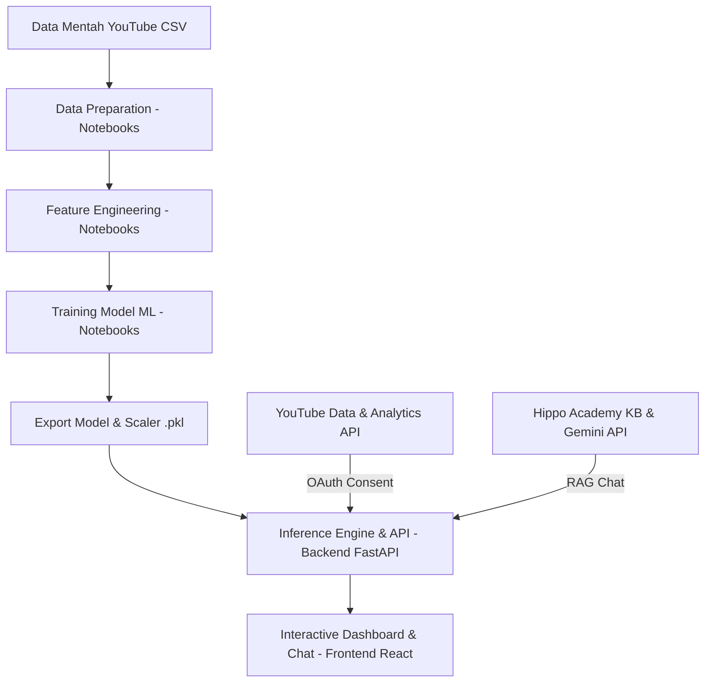

# YouTube View Decline Diagnosis & Hippo Academy — Global Project

Sistem analitik berbasis Machine Learning (ML) dan Retrieval-Augmented Generation (RAG) untuk mendiagnosis penurunan views video YouTube serta memberikan rekomendasi aksi optimasi secara real-time.

---

## 🛠️ Bahasa & Framework yang Digunakan (Global Stack)

### Frontend


- **React.js**: Framework utama antarmuka pengguna.
- **Vite**: Build tool dan dev server ultra-cepat.
- **Vanilla CSS**: Sistem gaya khusus untuk tampilan premium gelap (sleek dark mode & glassmorphism).
- **Lucide React & Recharts**: Ikonografi modern dan pustaka visualisasi grafik performa interaktif.
- **Axios**: HTTP client untuk interaksi endpoint backend dengan deteksi status OAuth terpadu.

### Backend


- **FastAPI & Uvicorn**: Framework web web-API Python performa tinggi.
- **Scikit-Learn, XGBoost & Prophet**: Pemodelan regresi prediksi views masa depan, deteksi anomali (Isolation Forest), serta peramalan deret waktu.
- **Google Generative AI (Gemini SDK)**: Layanan AI generatif untuk AI Consultant dan ide thumbnail kreatif.
- **Google API Python Client & isodate**: Integrasi API YouTube Data v3 dan YouTube Analytics v2.

### Jupyter Notebooks


- **Python 3.10+**: Bahasa pemrogaman utama.
- **Pandas, Numpy, & Matplotlib**: Pemrosesan data matriks dan visualisasi riset awal.
- **IPyKernel**: Pengelolaan kernel virtual environment lokal di Jupyter.

---

## 🔄 Alur Kerja Proyek Global (Global Project Workflow)



1. **Riset & Pemodelan (Data Science Pipeline)**:
   - Membersihkan data mentah dari YouTube dan menggabungkannya ke dataset bersih (`Data_Merged_Fix.csv`).
   - Melakukan rekayasa fitur (*feature engineering*) untuk metrik retensi dan CTR.
   - Melatih model regresi XGBoost (proyeksi views) dan Isolation Forest (deteksi anomali), lalu mengekspor objek model (`.pkl`) ke backend.
2. **Layanan REST API (Backend)**:
   - Memuat model ML saat startup dan menyediakan fungsi prediksi dinamis *on-the-fly*.
   - Menyediakan flow YouTube OAuth 2.0 untuk penarikan data performa channel pengguna secara langsung.
   - Mengelola sistem asisten AI dengan Gemini API dan pencarian RAG dari pustaka materi Hippo Academy.
3. **Antarmuka Pengguna (Frontend)**:
   - Menyajikan dashboard interaktif bagi pengguna untuk menghubungkan akun YouTube mereka.
   - Menampilkan visualisasi tren proyeksi views dan indikator deteksi anomali.
   - Menyediakan ruang chat interaktif untuk konsultasi dengan AI Consultant.

---

## 📁 Struktur Seluruh Folder (Global Directory Structure)

```text
.
├── backend/                  # Layanan REST API & Inference Engine (FastAPI)
│   ├── data/                 # Knowledge base RAG & local JSON database
│   ├── models/               # Model ML hasil latih (.pkl)
│   ├── routers/              # API Endpoint routers (auth, predict, stats, dll.)
│   ├── scalers/              # Scaler pkl pendukung data normalisasi
│   ├── utils/                # Modul pembantu (OAuth, API wrapper, model loader)
│   ├── .env.example          # Template file environment variables
│   ├── dev_backend.log       # Log aktivitas server API
│   ├── main.py               # Entry point FastAPI & setup server
│   └── requirements.txt      # Dependensi Python backend
│
├── frontend/                 # Aplikasi antarmuka pengguna (React + Vite)
│   ├── public/               # File statis publik
│   ├── src/                  # Kode sumber utama React
│   │   ├── components/       # Komponen UI modular (cards, alerts, navbar)
│   │   ├── pages/            # Halaman tampilan (Dashboard, Consult, Drafts)
│   │   ├── services/         # Koneksi API Client Axios (api.js)
│   │   ├── App.jsx           # Root React component & routes
│   │   ├── index.css         # Desain sistem styling global
│   │   └── main.jsx          # Entry point rendering DOM React
│   ├── package.json          # File konfigurasi npm & dependensi
│   └── vite.config.js        # Konfigurasi server Vite
│
├── notebooks/                # Workspace riset & pemodelan data scientist
│   ├── preparation/          # Notebook pembersihan data mentah
│   ├── feature_enginering/   # Notebook pengolahan rekayasa fitur data
│   ├── modelling/            # Notebook pelatihan & evaluasi model machine learning
│   └── README.md             # Panduan eksekusi notebook
│
├── docs/                     # Dokumentasi teknis & workflow integrasi
├── captonevenv/              # Python virtual environment (diabaikan oleh git)
├── .gitignore                # Aturan file yang tidak di-commit ke Git
└── README.md                 # Berkas panduan proyek global ini
```

---

*Catatan: Panduan instalasi dan penggunaan secara spesifik dapat ditemukan langsung di file `README.md` pada masing-masing direktori (`/frontend`, `/backend`, dan `/notebooks`).*
